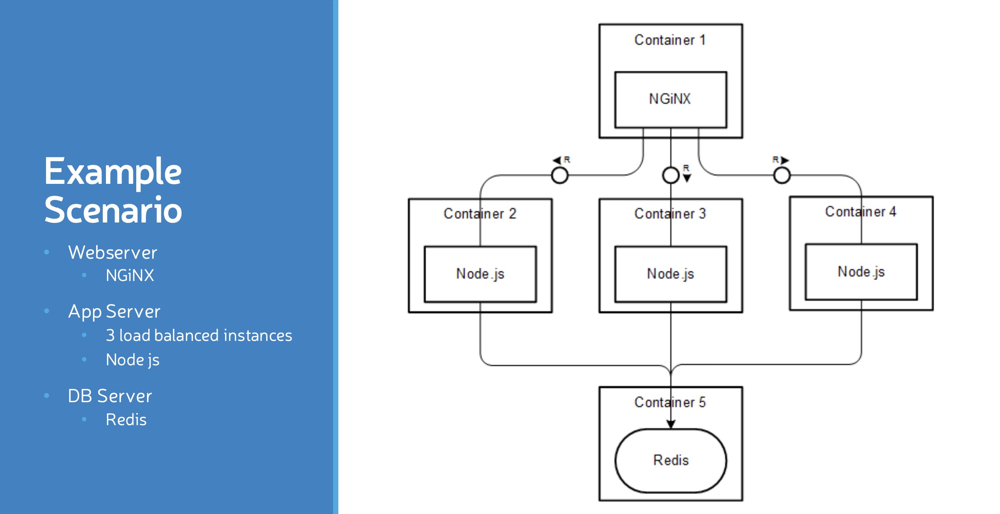

# Nginx Setup with Docker

## Overview

This project sets up a Dockerized environment with Nginx serving as a web server and load balancer for three Node.js backend services. A Redis database is also included to handle caching or other data storage needs. Docker Compose is used to manage and orchestrate the containers.

## Components

- **Nginx**: Acts as the web server and load balancer for the Node.js services.
- **Node1, Node2, Node3**: Node.js backend services that handle requests from Nginx.
- **Redis**: In-memory data store used by the Node.js services.

### Architecture Diagram



## Prerequisites

- Docker
- Docker Compose

## How to Run

1. **Build and Start Services**

   To build and start all services defined in the Docker Compose file, use the following command:

   ```bash
   docker-compose up --build
   ```

   This command builds the Docker images as per the Dockerfiles in the project and starts the containers.

2. **Access the Application**

   Once the services are running, you can access the Nginx server via:

   ```
   http://localhost:5555
   ```

   Nginx will load balance requests between the Node.js services.

3. **Stopping Services**

   To stop and remove all running containers, networks, and volumes, execute:

   ```bash
   docker-compose down
   ```

## Troubleshooting

- **Nginx Issues**: If Nginx fails to start, check the logs for errors and verify the configuration in `nginx.conf`. Ensure that Nginx can resolve the backend service names.

- **Node.js Issues**: If the Node.js services fail, inspect the container logs for errors. Ensure that the services are correctly built and all dependencies are installed.

- **Redis Connectivity**: Verify that the Node.js services can connect to the Redis container. Ensure Redis is running and accessible on the network.

## Configuration Files

- **Dockerfile for Nginx**: Configures Nginx as a web server and load balancer.
- **Dockerfile for Node.js**: Builds the Node.js application with necessary dependencies.
- **docker-compose.yml**: Orchestrates the Nginx, Node.js services, and Redis containers.

## Notes

- **Custom Dockerfiles**: Ensure that the Dockerfiles in the `nginx` and `node` directories are properly configured for your application needs.
- **Network Configuration**: The Docker Compose file sets up a custom network (`app-network`) to allow communication between containers.


